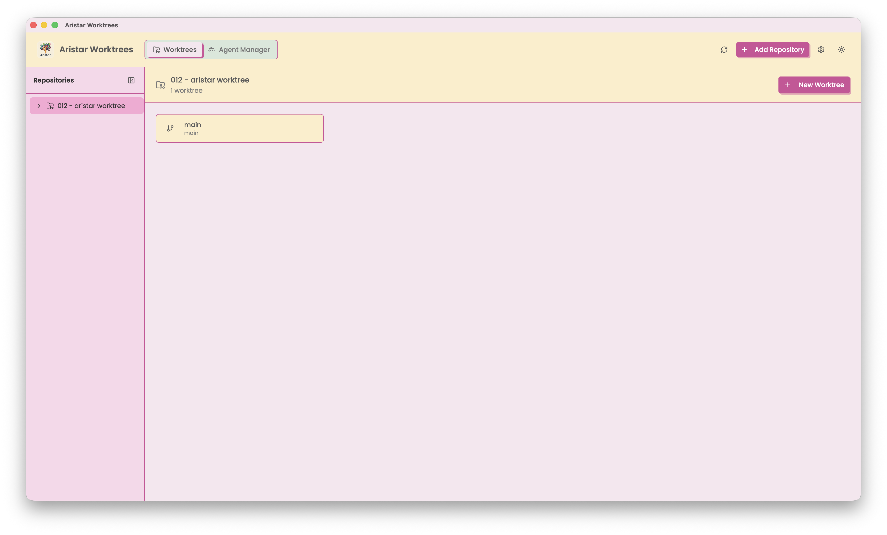
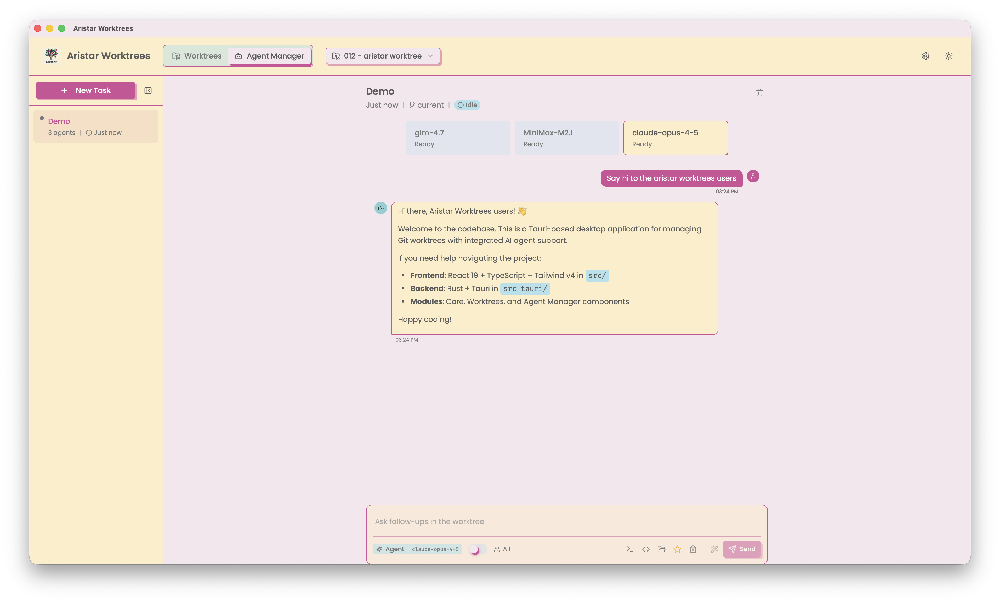

<div align="center">
  
</div>

# Aristar Worktrees

A beautiful Tauri application for managing Git worktrees with a modern UI.





> **macOS Note:** If you see "Aristar Worktrees is damaged and can't be opened", run:
> ```bash
> xattr -cr /Applications/Aristar\ Worktrees.app
> ```

## Features

- **Multiple Repository Support**: Add and manage worktrees across multiple Git repositories
- **Create Worktrees**: Create new worktrees from current branch, existing branches, or specific commits
- **Startup Scripts**: Define and execute startup scripts when creating worktrees
- **Navigate Easily**: Open worktrees in terminal, editor, or reveal in Finder with one click
- **Rename Worktrees**: Safely rename worktrees with proper Git metadata updates
- **Lock Worktrees**: Prevent accidental pruning with optional lock reasons
- **Dark/Light Theme**: Beautiful theming with system preference detection
- **Persistent State**: Your repositories and settings are automatically saved
- **Configurable Apps**: Choose your preferred terminal and code editor
- **AI Agent Orchestration**: Run multiple AI agents on the same task in isolated worktrees

## Tech Stack

- **Frontend**: React 19 + TypeScript + Vite
- **UI Components**: shadcn/ui + Tailwind CSS v4
- **Backend**: Rust + Tauri 2.0
- **State Management**: Zustand with localStorage persistence

## Getting Started

### Prerequisites

- [Bun](https://bun.sh/) or Node.js 18+
- Rust 1.77+
- Git
- macOS (currently macOS-only for terminal/editor integration)

### Installation

```bash
# Install dependencies
bun install

# Run in development mode
bun run tauri dev

# Build for production
bun run tauri build
```

## Usage

1. **Add a Repository**: Click "Add Repository" and select a Git repository
2. **Create a Worktree**: Click "New Worktree" and configure:
   - Worktree name
   - Source (current branch, existing branch, or commit)
   - Optional startup script
3. **Navigate**: Click "Terminal" to open in terminal, or use the menu for other options
4. **Manage**: Use the menu on each card to rename, lock, or delete worktrees

## Settings

Click the gear icon in the header to configure:

### Terminal Applications

| Terminal | Behavior |
|----------|----------|
| Terminal.app | Opens new window |
| Ghostty | Opens new tab in existing instance |
| Alacritty | Opens new window (tabs not supported via CLI) |
| Kitty | Opens in existing instance |
| iTerm2 | Opens new window |
| Warp | Opens new tab |
| Custom | User-defined command |

### Code Editors

Supported editors: VS Code, Cursor, Zed, Antigravity, or custom command.

### Themes

| Theme | Description |
|-------|-------------|
| Aristar | Playful and colorful with bold shadows (default) |
| Claude | Warm, earthy tones inspired by Anthropic Claude |
| Vercel | Clean and minimal monochrome design |
| Nature | Calming forest greens and earthy tones |
| T3 Chat | A warm, chat-focused color palette |

Each theme supports light, dark, or system preference modes.

For detailed documentation, see:
- [Architecture](docs/ARCHITECTURE.md)
- [Rust Backend](src-tauri/README.md)
- [Frontend API](src/modules/core/README.md)

## Storage Locations

| Data | Location |
|------|----------|
| Repository list & worktrees | `~/.aristar-worktrees/store.json` |
| App settings | Browser localStorage (`aristar-worktrees-store`) |
| Created worktrees | `~/.aristar-worktrees/{repo-hash}/{worktree-name}` |

## Development

### Running Tests

```bash
# Run Rust tests
cd src-tauri
cargo test

# Run frontend type checking
bun run tsc

# Run linting
bun run lint
```

### Building

```bash
# Development build
bun run tauri dev

# Production build
bun run tauri build
```

## License

MIT
