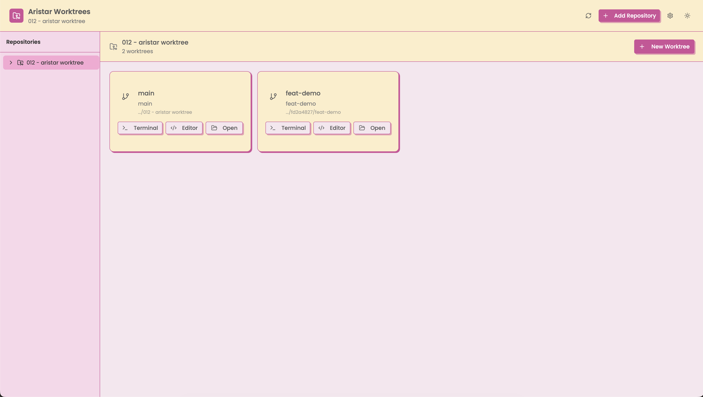

<div align="center">
  
</div>

# Aristar Worktrees

A beautiful Tauri application for managing Git worktrees with a modern UI.



> **macOS Note:** If you see "Aristar Worktrees is damaged and can't be opened", run:
> ```bash
> xattr -cr /Applications/Aristar\ Worktrees.app
> ```

## Features

- **Multiple Repository Support**: Add and manage worktrees across multiple Git repositories
- **Create Worktrees**: Create new worktrees from current branch, existing branches, or specific commits
- **Startup Scripts**: Define and execute startup scripts when creating worktrees
- **Navigate Easily**: Open worktrees in terminal, editor, or reveal in Finder with one click
- **Rename Worktrees**: Safely rename worktrees with proper Git metadata updates
- **Lock Worktrees**: Prevent accidental pruning with optional lock reasons
- **Dark/Light Theme**: Beautiful theming with system preference detection
- **Persistent State**: Your repositories and settings are automatically saved
- **Configurable Apps**: Choose your preferred terminal and code editor

## Tech Stack

- **Frontend**: React 19 + TypeScript + Vite
- **UI Components**: shadcn/ui + Tailwind CSS v4
- **Backend**: Rust + Tauri 2.0
- **State Management**: Zustand with localStorage persistence

## Getting Started

### Prerequisites

- [Bun](https://bun.sh/) or Node.js 18+
- Rust 1.77+
- Git
- macOS (currently macOS-only for terminal/editor integration)

### Installation

```bash
# Install dependencies
bun install

# Run in development mode
bun run tauri dev

# Build for production
bun run tauri build
```

## Usage

1. **Add a Repository**: Click "Add Repository" and select a Git repository
2. **Create a Worktree**: Click "New Worktree" and configure:
   - Worktree name
   - Source (current branch, existing branch, or commit)
   - Optional startup script
3. **Navigate**: Click "Terminal" to open in terminal, or use the menu for other options
4. **Manage**: Use the menu on each card to rename, lock, or delete worktrees

## Settings

Click the gear icon in the header to configure:

### Terminal Applications

| Terminal | Behavior |
|----------|----------|
| Terminal.app | Opens new window |
| Ghostty | Opens new tab in existing instance |
| Alacritty | Opens new window (tabs not supported via CLI) |
| Kitty | Opens in existing instance |
| iTerm2 | Opens new window |
| Warp | Opens new tab |
| Custom | User-defined command |

### Code Editors

Supported editors: VS Code, Cursor, Zed, Antigravity, or custom command.

## Project Structure

```
aristar-worktrees/
├── src/                          # React frontend
│   ├── components/               # React components
│   │   ├── ui/                   # shadcn/ui components
│   │   ├── create-worktree-dialog.tsx
│   │   ├── header.tsx
│   │   ├── rename-dialog.tsx
│   │   ├── repository-sidebar.tsx
│   │   ├── settings-dialog.tsx
│   │   ├── theme-toggle.tsx
│   │   └── worktree-card.tsx
│   ├── lib/                      # Utilities
│   │   ├── branch-colors.ts      # Branch color system
│   │   ├── commands.ts           # Tauri command wrappers
│   │   └── utils.ts              # General utilities
│   ├── store/                    # State management
│   │   ├── types.ts              # TypeScript types
│   │   └── use-app-store.ts      # Zustand store
│   ├── assets/                   # Static assets
│   │   ├── editors/              # Editor icons
│   │   └── terminals/            # Terminal icons
│   ├── App.tsx                   # Main app component
│   ├── main.tsx                  # Entry point
│   └── index.css                 # Global styles
├── src-tauri/                    # Rust backend
│   ├── src/
│   │   ├── commands/
│   │   │   ├── mod.rs            # Tauri commands
│   │   │   ├── worktree.rs       # Git worktree operations
│   │   │   └── tests/            # Unit & integration tests
│   │   ├── models/
│   │   │   └── mod.rs            # Data models
│   │   ├── lib.rs                # Library entry
│   │   └── main.rs               # Application entry
│   ├── Cargo.toml                # Rust dependencies
│   └── tauri.conf.json           # Tauri configuration
└── package.json                  # Frontend dependencies
```

## Architecture

### Frontend (React + TypeScript)

The frontend uses a component-based architecture with:

- **Zustand** for global state management with localStorage persistence
- **shadcn/ui** components built on Radix UI primitives
- **Tailwind CSS v4** for styling with CSS variables for theming

### Backend (Rust + Tauri)

The backend handles:

- Git operations via shell commands (`git worktree`, `git branch`, etc.)
- File system operations for worktree management
- Opening external applications (terminals, editors, Finder)
- Persistent storage in `~/.aristar-worktrees/store.json`

### Data Flow

```
┌─────────────────┐     ┌─────────────────┐     ┌─────────────────┐
│  React Store    │────▶│  Tauri Commands │────▶│  Git Commands   │
│  (Zustand)      │◀────│  (Rust)         │◀────│  (Shell)        │
└─────────────────┘     └─────────────────┘     └─────────────────┘
        │                        │
        ▼                        ▼
┌─────────────────┐     ┌─────────────────┐
│  localStorage   │     │  ~/.aristar-    │
│  (settings)     │     │  worktrees/     │
└─────────────────┘     └─────────────────┘
```

## API Reference

### Tauri Commands

| Command | Description |
|---------|-------------|
| `get_repositories` | Get all stored repositories |
| `add_repository` | Add a new Git repository |
| `remove_repository` | Remove a repository from the app |
| `refresh_repository` | Refresh worktree list for a repository |
| `create_worktree` | Create a new worktree |
| `remove_worktree` | Delete a worktree |
| `rename_worktree` | Rename a worktree |
| `lock_worktree` | Lock a worktree |
| `unlock_worktree` | Unlock a worktree |
| `get_branches` | Get all branches for a repository |
| `get_commits` | Get recent commits for a repository |
| `open_in_terminal` | Open path in configured terminal |
| `open_in_editor` | Open path in configured editor |
| `reveal_in_finder` | Reveal path in Finder |
| `copy_to_clipboard` | Copy text to clipboard |

### TypeScript Types

```typescript
interface WorktreeMetadata {
  id: string;
  repositoryId: string;
  name: string;
  path: string;
  branch?: string;
  commit?: string;
  isMain: boolean;
  isLocked: boolean;
  lockReason?: string;
  startupScript?: string;
  scriptExecuted: boolean;
  createdAt: number;
}

interface Repository {
  id: string;
  path: string;
  name: string;
  worktrees: WorktreeMetadata[];
  lastScanned: number;
}

interface AppSettings {
  theme: 'light' | 'dark' | 'system';
  terminalApp: TerminalApp;
  customTerminalCommand?: string;
  editorApp: EditorApp;
  customEditorCommand?: string;
  autoRefresh: boolean;
}

type TerminalApp = 'terminal' | 'ghostty' | 'alacritty' | 'kitty' | 'iterm' | 'warp' | 'custom';
type EditorApp = 'vscode' | 'cursor' | 'zed' | 'antigravity' | 'custom';
```

## Storage Locations

| Data | Location |
|------|----------|
| Repository list & worktrees | `~/.aristar-worktrees/store.json` |
| App settings | Browser localStorage (`aristar-worktrees-store`) |
| Created worktrees | `~/.aristar-worktrees/{repo-hash}/{worktree-name}` |

## Development

### Running Tests

```bash
# Run Rust tests
cd src-tauri
cargo test

# Run frontend type checking
bun run tsc

# Run linting
bun run lint
```

### Building

```bash
# Development build
bun run tauri dev

# Production build
bun run tauri build
```

## License

MIT
